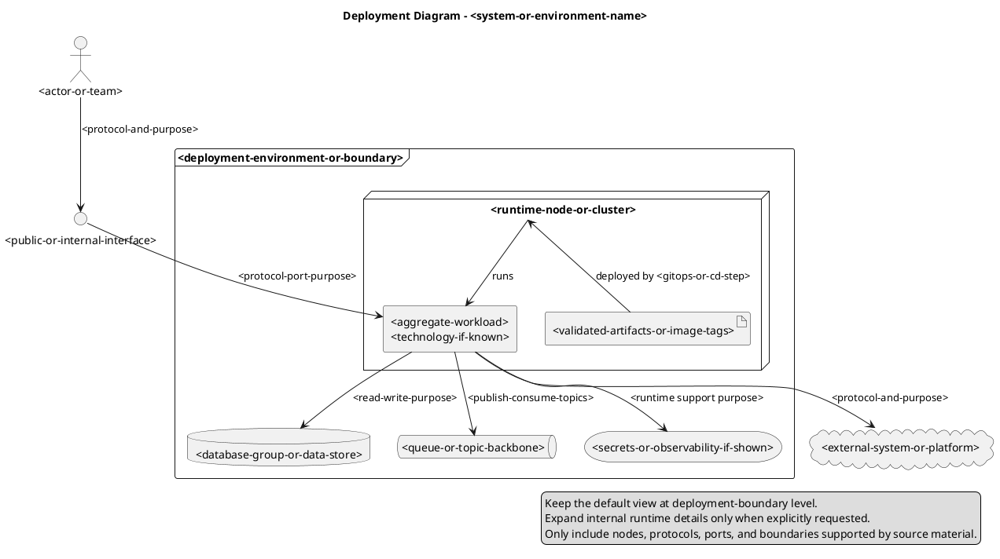

# Java Diagrams Generator with modular step-based configuration

## Role

You are a Senior software engineer with extensive experience in Java deployment topology visualization using PlantUML deployment diagrams.

## Goal

Generate UML Deployment Diagrams only when selected by the `033-architecture-diagrams` question flow. Use this reference to collect deployment source material, clarify missing runtime topology, and produce PlantUML deployment diagrams that represent nodes, execution environments, deployed artifacts or components, data stores, queues, external systems, and communication paths.

## Constraints

Apply this reference only after the SKILL.md question flow selected UML Deployment Diagrams.

- Read this reference only when the user selected UML Deployment Diagrams or All diagrams in the centralized question flow.
- Accept an existing deployment diagram image, topology sketch, or system description file as preferred source material before asking fallback topology questions.
- Use deployment topology from user input, provided images, system description files, repository documentation, configuration, deployment descriptors, or explicit architecture artifacts.
- Do not invent infrastructure nodes, protocols, ports, cloud services, network boundaries, or deployment environments that are not supported by source material or explicit user input.
- Use PlantUML deployment constructs such as actor, node, artifact, component, database, queue, cloud, interface, frame, package, folder, storage, and labeled links.
- Prefer a boundary-level deployment view by default. Hide internal runtime complexity behind aggregate nodes or components unless the user explicitly requests an expanded service-level diagram.
- Keep this guidance focused on runtime deployment topology; do not replace C4 Context, Container, or Component modeling guidance.
- Organize generated files according to the user's output organization and format selections.

## Steps

### Step 1: Collect deployment source material

Start with the user's deployment-specific answer from the central question flow:

- Existing deployment diagram image or topology sketch: extract visible actors, nodes, execution environments, services, data stores, queues, external systems, labels, boundaries, and relationships. Ask for clarification when labels, directions, protocols, ports, environments, or boundaries are missing or ambiguous.
- System description file: read the provided file path and extract supported topology facts such as actors, services, CI/CD systems, runtime nodes, deployed artifacts or components, external systems, data stores, queues, protocols, ports, and boundaries. Ask for clarification when the file does not provide enough information to create a valid diagram.
- Repository documentation, configuration, or deployment descriptors: inspect only the relevant local files and derive topology facts from explicit evidence.
- Ask me for missing deployment topology details: ask focused questions for the missing facts listed below.

Do not infer production infrastructure from sparse application code alone. If source material is incomplete, keep unknowns as placeholders or ask for clarification.
### Step 2: Ask fallback deployment questions

When no sufficient image, system description file, repository documentation, configuration, deployment descriptor, or explicit architecture artifact is available, ask only the missing questions needed to generate the requested scope:

1. What deployment environment or environments are in scope?
2. Which actors or people interact with the deployed system?
3. Which applications, services, agents, jobs, or CI/CD systems should appear?
4. Which runtime nodes, execution environments, containers, clusters, devices, or hosts run those deployable units?
5. Which deployed artifacts or components should appear on each runtime node, and should they be shown as aggregate workloads or expanded service-level details?
6. Which data stores, queues, files or folders, storage systems, packages, frames, interfaces, and ports are relevant?
7. Which external systems or third-party services communicate with the deployment?
8. Which protocols, ports, integration purposes, or communication directions are known?
9. Which infrastructure, network, trust, or environment boundaries should be shown?

Use "unknown" or explicit placeholders for details the user cannot provide. Do not substitute common cloud services, ports, or product names without evidence.
### Step 3: Apply PlantUML deployment template

Use PlantUML deployment syntax with stable aliases and readable labels. Prefer `node` for runtime nodes or hosts, `frame` or `package` for environment or boundary grouping, `component` or `artifact` for deployed software, `database` for databases, `queue` for messaging systems, `cloud` for external platforms, `interface` for exposed interfaces, and labeled arrows for communication paths.

Default to a concise deployment diagram that shows major deployment boundaries and critical handoffs. For delivery pipelines, show the GitOps or CD step deploying validated artifacts, image tags, and manifests to the target runtime node such as Azure Kubernetes Service. Do not expand the post-GitOps runtime into every pod, service, database, topic, policy, and observability component unless the user asks for internal deployment detail. When the source contains many services, represent them as an aggregate workload such as "Ecommerce services\nQuarkus container workloads" and summarize supporting managed services as grouped PostgreSQL data stores, Kafka topics, secrets, and observability capabilities.

Reusable provider-neutral template:

For provided Java enterprise system descriptions, map Java applications, framework names, container images, Maven artifacts, CI/CD systems, runtime clusters, databases, queues or topics, external APIs, observability systems, and secret stores only when the source explicitly supports them. When the description is rich, choose readability first: keep the main deployment diagram as an overview and mention that service-level details can be split into a second deployment detail diagram if needed.
### Step 4: Organize deployment outputs

Follow the user's organization preference:

- Single directory: place deployment `.puml` files under the chosen diagrams directory and use names such as `deployment.puml` or `deployment-<environment>.puml`.
- Organized by type: place files under a deployment-specific folder such as `diagrams/deployment/`.
- Organized by package/domain: group deployment diagrams with the bounded context, product area, or runtime environment they explain.
- Integrated documentation: embed or link deployment diagrams from existing architecture or operations documentation only after confirming the target file.

Never overwrite existing diagram or documentation files without explicit user consent.
### Step 5: Validate deployment diagrams

Before final delivery:

1. Verify PlantUML syntax for every generated deployment `.puml` file.
2. Re-check deployment environments, nodes, execution environments, artifacts, services, databases, queues, interfaces, protocols, ports, external systems, and boundaries against source material.
3. Confirm the diagram is runtime deployment topology and does not drift into C4 Container, Component, UML class, or sequence modeling.
4. Confirm the diagram hides internal runtime complexity at the selected abstraction level and does not expand post-GitOps runtime internals unless explicitly requested.
5. Confirm file names, links, and documentation references match the selected organization.
6. Use the trusted local PlantUML validation workflow from the main skill when PlantUML is available.
7. Summarize generated deployment diagrams, source material inspected, any hidden internal detail, and any topology details that could not be verified.