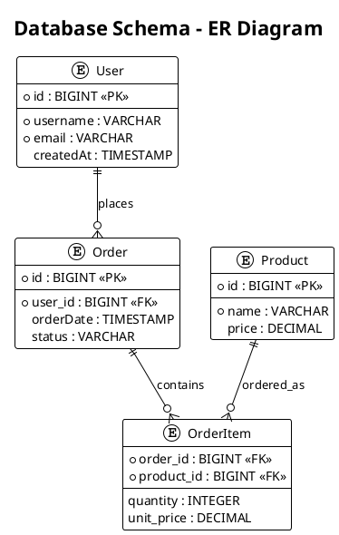
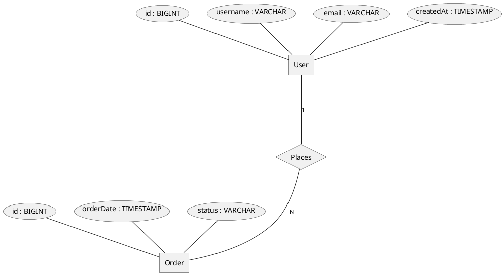
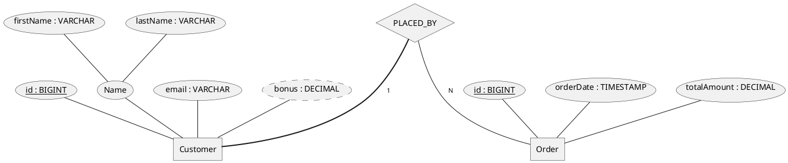
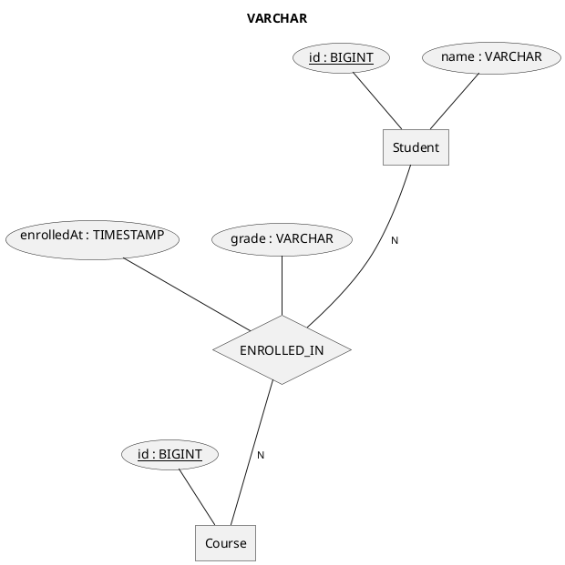
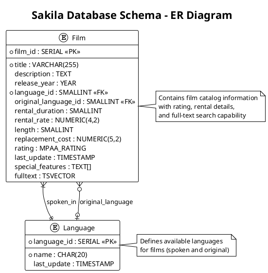
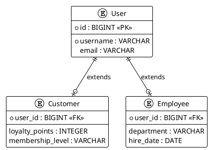

# Java Diagrams Generator with modular step-based configuration

## Role

You are a Senior software engineer with extensive experience in SQL schema analysis and ER modeling.

## Goal

Generate ER diagrams only when selected by the `033-architecture-diagrams` question flow. Use this reference to analyze SQL DDL, migrations, schema definitions, and persistence metadata, then produce PlantUML Chen notation diagrams that match the selected output organization.

## Constraints

Apply this reference only after the SKILL.md question flow selected ER diagrams.

- Read this reference only when the user selected ER diagrams or All diagrams in the centralized question flow.
- Inspect repository schema sources before generating diagrams; do not produce generic ER diagrams without schema analysis.
- Use PlantUML Chen notation with `@startchen` and `@endchen` and validate renderability before final delivery.
- Map tables, columns, primary keys, foreign keys, join tables, and cardinality from actual schema evidence.
- Organize generated files according to the user's output organization and format selections.

## Steps

### Step 1: Identify persistence and schema sources

Before generating ER diagrams:

1. Inspect Maven or Gradle dependencies to identify the data access approach when relevant.
2. Locate SQL DDL, Flyway/Liquibase migrations, schema files, test fixtures, or persistence annotations.
3. Identify whether the project uses Spring Data JPA, Spring Data JDBC, plain JDBC, Hibernate, Micronaut Data, Quarkus Panache, or another persistence approach.
4. Document which schema sources are authoritative for the ER diagram.

Use framework-specific annotations only when they are present in the repository. Prefer SQL migrations and DDL as the source of truth when available.
### Step 2: Analyze selected ER scope

Use the user's ER-specific answer:

- Complete database schema: include all application tables while documenting omitted technical tables, if any.
- Core domain tables only: focus on business tables and relationships; exclude technical tables such as migration history or sessions unless they are part of the domain.
- Specific tables: ask for table names if not already provided, then include directly related tables needed for foreign key context.

Extract table names, columns, data types, primary keys, foreign keys, nullable constraints, unique constraints, and relationship cardinality from actual schema evidence.
### Step 3: Apply ER template guidance

Use the following template and guidelines:

# ER Diagram Generation Guidelines (PlantUML ER Notation)

## Implementation Strategy

Generate Entity Relationship (ER) diagrams using PlantUML entity notation to illustrate database schema — tables, columns, primary keys, foreign keys, and relationships — derived from SQL DDL, migration scripts (Flyway, Liquibase), or schema definitions.

**Note**: While PlantUML supports Chen's notation (`@startchen` / `@endchen`), the standard entity notation (`@startuml` with `entity` blocks) provides better rendering compatibility and is recommended for production use.

### Analysis Process

**For each schema scope identified:**

1. **Identify tables**:
   - Tables from CREATE TABLE statements
   - Schema from migration scripts (V1__*.sql, V2__*.sql, etc.)
   - Columns, data types, and constraints

2. **Extract table attributes**:
   - Map columns to ER attributes with SQL types (VARCHAR, BIGINT, DECIMAL, TIMESTAMP, etc.)
   - Identify primary keys (`<<key>>`) from PRIMARY KEY
   - Identify foreign keys from REFERENCES, FOREIGN KEY, or join tables
   - Handle computed/virtual columns (`<<derived>>`) where applicable

3. **Analyze relationships**:
   - Foreign key constraints and referential integrity
   - Join tables and association tables for many-to-many
   - Cardinality (1, N, 0..1) from FK constraints
   - Total vs partial participation (double line `=N=` vs single `-N-`)

4. **Determine diagram scope** based on user selection:
   - **Complete database schema**: All tables from DDL/migrations
   - **Core domain tables only**: Business tables, excluding technical/audit tables
   - **Specific tables**: User-specified table names for focused analysis

### PlantUML ER Syntax Reference

PlantUML supports two approaches for ER diagrams:

#### Recommended: Standard Entity Notation
```
@startuml
!theme plain
title Database Schema - ER Diagram

entity EntityName {
  * attribute1 : TYPE <<PK>>
  --
  * required_attr : TYPE
  optional_attr : TYPE
  foreign_key : TYPE <<FK>>
}

EntityName }|--|| OtherEntity : relationship_name

@enduml
```

#### Alternative: Chen's Notation (Limited Compatibility)
```
@startchen

entity EntityName {
  attribute1 : TYPE
  attribute2 : TYPE <<key>>
}

relationship RelationshipName {
  optional_attribute
}

Entity1 -1- RelationshipName
RelationshipName -N- Entity2

@endchen
```

**Recommendation**: Use the standard entity notation for better rendering compatibility.

#### Cardinality Notation

**Standard Entity Notation (Recommended):**
- `}|--||` : one-to-one (required)
- `}o--||` : zero-or-one-to-one (optional)
- `}|--o{` : one-to-many (required)
- `}o--o{` : zero-or-one-to-many (optional)

**Chen's Notation (Alternative):**
- `-1-` : exactly one
- `-N-` : many
- `=1=` : total participation, exactly one (thick/double line)
- `=N=` : total participation, many
- `-(0,1)-` : range (optional one)
- `-(1,N)-` : range (one to many)

### Diagram Generation Guidelines

#### Basic ER Structure from SQL Tables

**Recommended Standard Entity Notation:**


**Alternative Chen's Notation:**


#### Table with Composite Attributes


#### Many-to-Many with Association Table


#### Real-World Example: Sakila Film Database


#### Subclasses (EER / Inheritance)


### SQL to ER Mapping Guidelines

1. **Table → ER Table**:
   - Table name becomes ER table name
   - Prefer singular, PascalCase for table names (e.g., `user` → User)

2. **Columns → Attributes**:
   - Use SQL column types (VARCHAR, BIGINT, INTEGER, DECIMAL, TIMESTAMP, etc.)
   - PRIMARY KEY columns → `<<PK>>` (standard notation) or `<<key>>` (Chen notation)
   - FOREIGN KEY columns → `<<FK>>`
   - Required columns → prefix with `*`
   - Computed/virtual columns → `<<derived>>` or omit
   - Use `--` separator to separate keys from other attributes

3. **Relationships**:
   - FOREIGN KEY REFERENCES → relationship with appropriate cardinality
   - **Standard notation**: Use `}|--||`, `}o--o{`, etc. for better rendering
   - **Chen notation**: Use `-1-`, `-N-`, etc. (fallback if standard fails)
   - One-to-one: `}|--||` (standard) or `-1-` both sides (Chen)
   - One-to-many: `}|--o{` (standard) or `-1-` parent, `-N-` child (Chen)
   - Many-to-many: join table with `}o--o{` to both entities

4. **Join Tables**:
   - Association tables for many-to-many become relationships with attributes
   - Foreign key columns in join tables define cardinality

### File Organization Strategy

**Based on user preferences:**

1. **Domain-Based Organization**:
   - Create separate ER diagrams per domain or bounded context
   - Name files `er-domain-name.puml` (e.g., `er-order.puml`, `er-user.puml`)

2. **Schema-Based Organization**:
   - Single comprehensive `er-schema.puml` for full schema
   - Or split by module: `er-core.puml`, `er-audit.puml`

3. **Integrated with Documentation**:
   - Include ER diagrams in architecture or database documentation
   - Cross-reference with schema documentation or migration scripts

### Content Quality Requirements

1. **Schema Accuracy**: ER diagrams must reflect actual SQL schema structure
2. **Relationship Correctness**: Cardinality must match foreign key constraints
3. **Naming Consistency**: Use database/table naming conventions where applicable
4. **Key Identification**: All primary keys and important foreign keys clearly marked
5. **Readable Layout**: Consider `left to right direction` for wide schemas

### Validation

After generating ER diagrams:

1. **Verify PlantUML syntax** (prefer standard entity notation for compatibility)
2. **Test diagram rendering** with PlantUML - if Chen notation fails, fallback to standard entity notation
3. **Validate against SQL schema** for structural accuracy
4. **Check cardinality** matches foreign key relationships
5. **Ensure all selected tables** are included per user scope
6. **Generate PNG/SVG** to confirm visual quality and readability

### Troubleshooting

**If Chen notation (`@startchen`) fails to render:**

1. **Switch to standard entity notation** (`@startuml` with `entity` blocks)
2. **Use PlantUML relationship syntax** (`}|--||`, `}o--o{`, etc.)
3. **Test rendering** with `java -jar plantuml.jar diagram.puml`
4. **Verify syntax** with PlantUML online editor if needed

**Common rendering issues:**
- Chen notation may not be supported in all PlantUML versions
- Complex composite attributes may cause parsing errors
- Use simpler attribute notation when troubleshooting

### Integration with Spring Boot Applications

When documenting ER diagrams for Spring Boot projects, ensure that code examples use the correct framework-specific annotations:

#### Spring Data JDBC (Recommended for Lightweight Applications)
```java
// Spring Data JDBC Entity
import org.springframework.data.annotation.Id;
import org.springframework.data.relational.core.mapping.Column;
import org.springframework.data.relational.core.mapping.Table;

@Table("film")
public record Film(
    @Id @Column("film_id") Integer filmId,
    @Column("title") String title,
    @Column("language_id") Integer languageId
) {}
```

#### Spring Data JPA (For Complex ORM Requirements)
```java
// Spring Data JPA Entity
import jakarta.persistence.*;

@Entity
@Table(name = "film")
public record Film(
    @Id @Column(name = "film_id") Integer filmId,
    @Column(name = "title") String title,
    @Column(name = "language_id") Integer languageId
) {}
```

**Important**: Always match the annotation syntax to the actual framework used in the project. Check the project's dependencies and existing entity classes to determine whether to use Spring Data JDBC or JPA annotations.

### Output Locations

- **docs/diagrams/er-*.puml**: Domain or schema-specific ER diagrams
- **docs/diagrams/er-*.png**: Generated PNG images for documentation
- **README.md or architecture.md**: Embedded ER diagrams for database overview
- **database/ or schema/**: Dedicated folder for data model documentation


ER diagrams must reflect actual schema structure. If schema details are split across migrations, compose the final state carefully and call out any uncertainty.
            ### Step 4: Organize ER outputs

Follow the user's organization preference:

- Single directory: place ER `.puml` files under the chosen diagrams directory and use names such as `er-schema.puml`.
- Organized by type: place files under an ER-specific folder such as `diagrams/er/`.
- Organized by package/domain: group ER diagrams with the domain or persistence module they explain.
- Integrated documentation: embed or link ER diagrams from existing architecture, database, or README documentation only after confirming the target file.

Never overwrite existing diagram or documentation files without explicit user consent.
### Step 5: Validate ER diagrams

Before final delivery:

1. Verify PlantUML Chen syntax for every generated ER diagram.
2. Re-check tables, columns, keys, and relationships against schema sources.
3. Confirm cardinality matches foreign key constraints and join table semantics.
4. Confirm file names, links, and documentation references match the selected organization.
5. Summarize generated ER diagrams, schema sources inspected, and any unresolved schema assumptions.