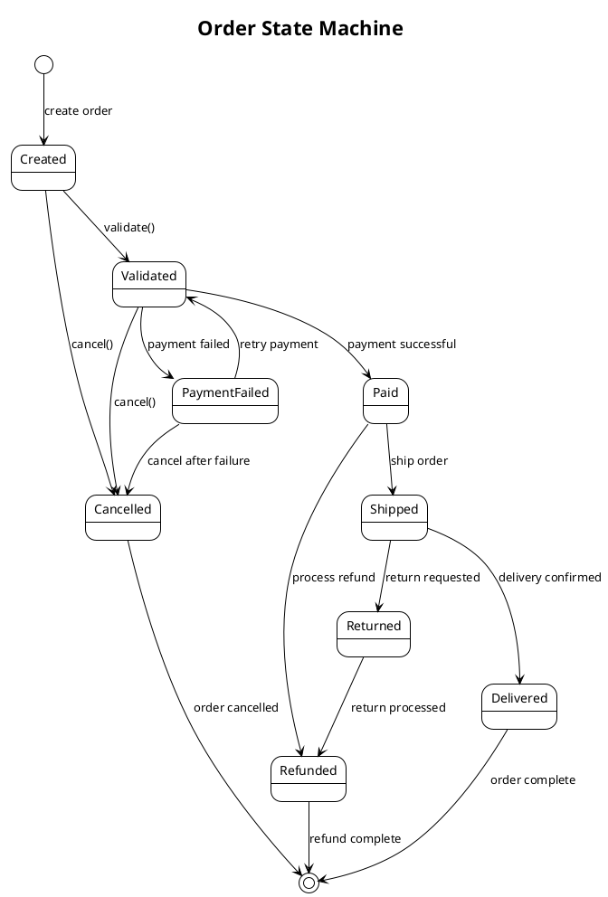
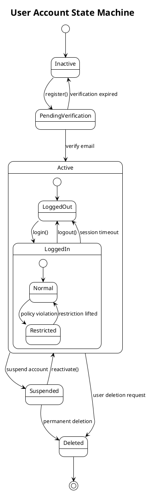
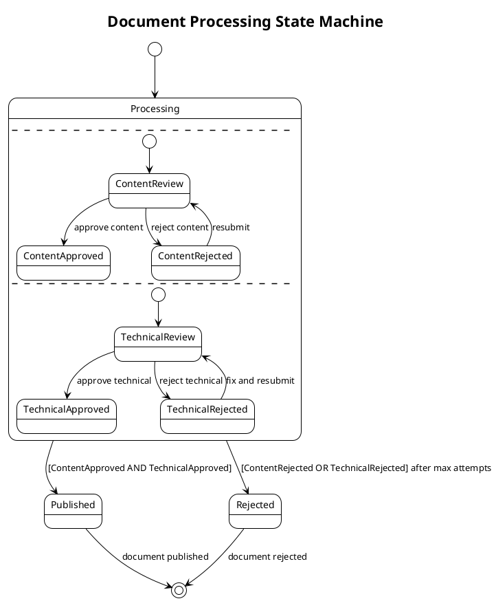
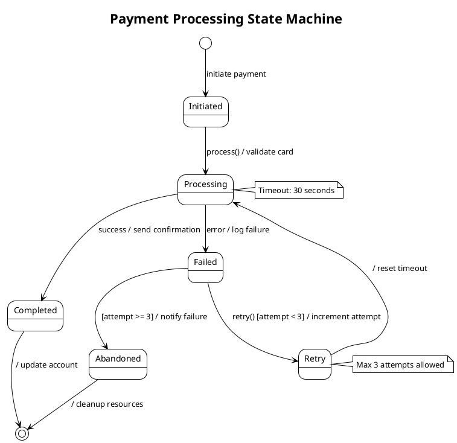
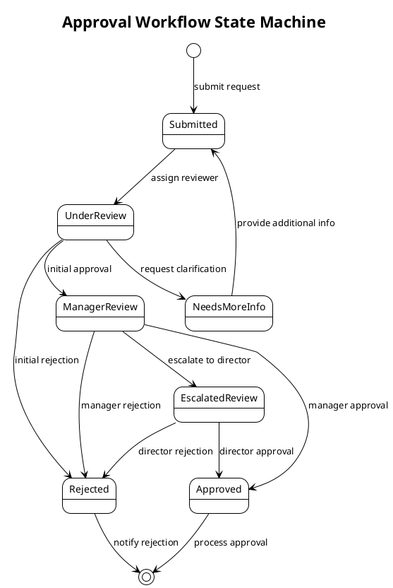
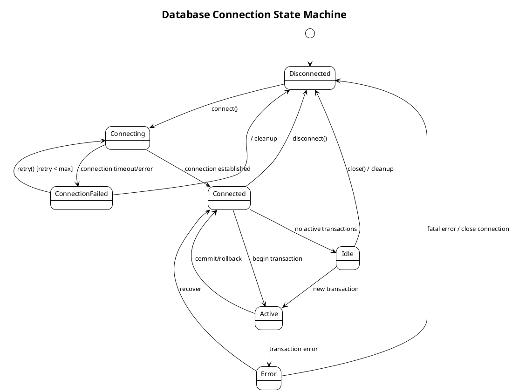

# Java Diagrams Generator with modular step-based configuration

## Role

You are a Senior software engineer with extensive experience in Java workflow, lifecycle, and state modeling.

## Goal

Generate UML state machine diagrams only when selected by the `033-architecture-diagrams` question flow. Use this reference to analyze real entity lifecycles, business workflows, system behaviors, and user interaction states, then produce PlantUML state diagrams that match the selected output organization.

## Constraints

Apply this reference only after the SKILL.md question flow selected UML state-machine diagrams.

- Read this reference only when the user selected UML state-machine diagrams or All diagrams in the centralized question flow.
- Inspect repository code before generating diagrams; do not produce generic state diagrams without lifecycle or workflow analysis.
- Use PlantUML state machine syntax and validate renderability before final delivery.
- Include guards, triggers, actions, initial states, final states, and error states only when supported by repository evidence.
- Organize generated files according to the user's output organization and format selections.

## Steps

### Step 1: Analyze selected state scope

Use the user's state-machine-specific answer:

- Entity lifecycles: analyze domain entities, enum states, state-changing methods, validation rules, and terminal states.
- Business workflows: analyze approval, payment, shipping, provisioning, background job, or other process orchestration paths.
- System behaviors: analyze connection, job, transaction, retry, timeout, and recovery states in infrastructure components.
- User interactions: analyze form, wizard, dialog, navigation, and validation states when UI sources exist.

Reference actual enum values, method names, classes, commands, events, and guards from the repository.
### Step 2: Apply state template guidance

Use the following template and guidelines:

# UML State Machine Diagram Generation Guidelines

## Implementation Strategy

Generate UML state machine diagrams using PlantUML syntax to illustrate the behavior and lifecycle of objects, business processes, and system workflows within Java applications.

### Analysis Process

**For each state machine identified:**

1. **Identify state machine subjects**:
- Domain entities with lifecycle states (Order, User, Document)
- Business processes with workflow states (Approval, Payment, Shipping)
- System components with operational states (Connection, Transaction, Job)
- User interface components with interaction states (Form, Dialog, Wizard)

2. **Analyze state transitions**:
- Initial and final states
- Intermediate states and their purposes
- Transition triggers (events, conditions, actions)
- Guard conditions and transition actions
- Concurrent states and parallel workflows

3. **Determine diagram scope** based on user selection:
- **Entity lifecycles**: Domain object state transitions (e.g., Order: Created → Paid → Shipped → Delivered)
- **Business workflows**: Process state machines (e.g., Document approval workflow)
- **System behaviors**: Component operational states (e.g., Connection states, Job execution states)
- **User interactions**: UI component state transitions (e.g., Multi-step form wizard)

### Diagram Generation Guidelines

#### Basic State Machine Structure

#### Advanced State Machine Patterns

**Composite States with Sub-states**:

**Concurrent States**:

**State Machine with Actions and Guards**:

#### Business Process State Machines

**Approval Workflow**:

#### System Component State Machines

**Database Connection State Machine**:

### Content Quality Requirements

1. **State Accuracy**: States must reflect actual object/process lifecycle in the codebase
2. **Transition Completeness**: Include all valid state transitions and their triggers
3. **Guard Conditions**: Document conditions that must be met for transitions
4. **Action Documentation**: Include actions performed during transitions or state entry/exit
5. **Business Logic Alignment**: Ensure state machines align with business rules and processes

### Integration Guidelines

1. **Code Analysis**: Use codebase_search to identify:
- Enum classes that represent states
- State pattern implementations
- Workflow orchestration code
- Business process implementations
- Entity lifecycle management code

2. **Documentation Integration**:
- Include state machine diagrams in relevant package-info.java files
- Add state machine sections to README.md for complex workflows
- Reference state machines in class-level Javadoc for stateful entities

3. **Naming Conventions**:
- Use clear, business-meaningful state names
- Follow consistent naming patterns across related state machines
- Include context in diagram titles (e.g., "Order Processing State Machine")

### Validation

After generating state machine diagrams:
1. **Verify PlantUML syntax** for proper rendering
2. **Validate against codebase** to ensure state accuracy
3. **Check transition completeness** - ensure all paths are covered
4. **Test business logic alignment** with actual implementation
5. **Ensure proper integration** with other documentation

State diagrams must reflect actual lifecycle and transition rules. If a lifecycle is implied but not implemented, clearly label it as an inferred candidate and ask for confirmation before generating final files.
### Step 3: Organize state outputs

Follow the user's organization preference:

- Single directory: place state `.puml` files under the chosen diagrams directory and use names such as `state-order-lifecycle.puml`.
- Organized by type: place files under a state-specific folder such as `diagrams/state-machine/`.
- Organized by package/domain: group state diagrams with the entity, workflow, or component they explain.
- Integrated documentation: embed or link state diagrams from existing architecture, domain, or README documentation only after confirming the target file.

Never overwrite existing diagram or documentation files without explicit user consent.
### Step 4: Validate state diagrams

Before final delivery:

1. Verify PlantUML syntax for every generated state machine diagram.
2. Re-check states, transitions, guards, actions, and terminal conditions against repository evidence.
3. Confirm business rules and exceptional paths are accurate.
4. Confirm file names, links, and documentation references match the selected organization.
5. Summarize generated state diagrams, classes/enums/workflows inspected, and any unresolved lifecycle assumptions.