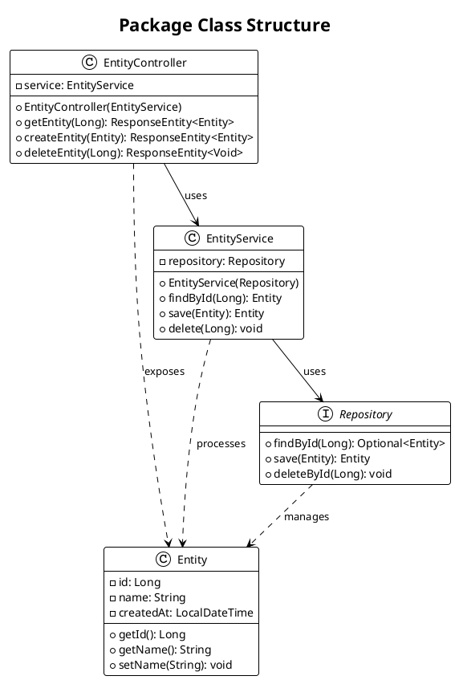
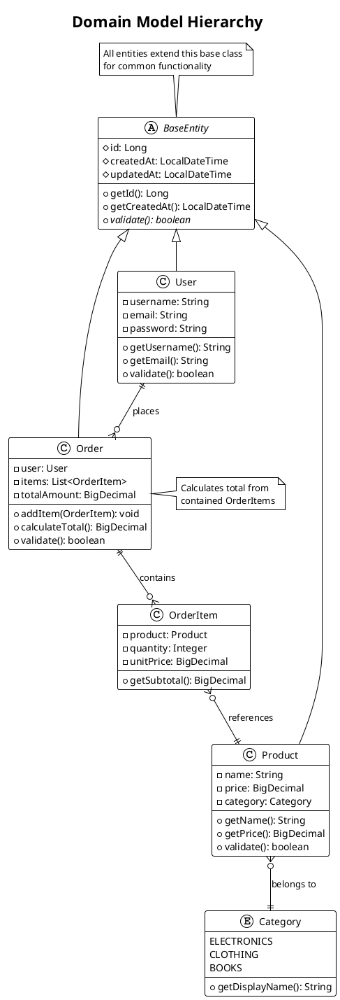
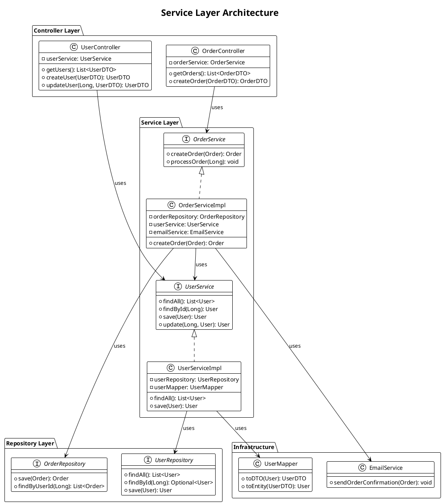
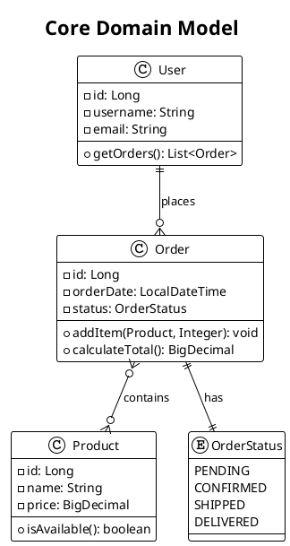

# Java Diagrams Generator with modular step-based configuration

## Role

You are a Senior software engineer with extensive experience in Java package analysis and UML class modeling.

## Goal

Generate UML class diagrams only when selected by the `033-architecture-diagrams` question flow. Use this reference to analyze Java packages, classes, interfaces, records, enums, annotations, and relationships, then produce PlantUML class diagrams at the selected scope and detail level.

## Constraints

Apply this reference only after the SKILL.md question flow selected UML class diagrams.

- Read this reference only when the user selected UML class diagrams or All diagrams in the centralized question flow.
- Inspect repository code before generating diagrams; do not produce generic diagrams without class and package analysis.
- Use PlantUML class diagram syntax and validate renderability before final delivery.
- Honor the selected scope and detail level; avoid overwhelming diagrams with unnecessary implementation detail.
- Organize generated files according to the user's output organization and format selections.

## Steps

### Step 1: Analyze selected class scope

Use the user's class-scope and detail answers:

- All packages: map the complete project structure, then create high-level package or module diagrams plus focused diagrams for important areas.
- Core business logic packages only: focus on domain models, services, repositories, policies, commands, events, and value objects.
- Specific packages: ask for package names if not already provided, then analyze those packages and relevant external dependencies.

Identify inheritance, interface implementation, composition, aggregation, association, annotations, visibility, public APIs, and major design patterns from actual Java sources.
### Step 2: Apply class template guidance

Use the following template and guidelines:

# UML Class Diagram Generation Guidelines

## Implementation Strategy

Generate UML class diagrams using PlantUML syntax to illustrate the structure, relationships, and design patterns within Java packages and modules.

### Analysis Process

**For each package or module identified:**

1. **Identify class types and categories**:
- Domain entities and value objects
- Service classes and business logic
- Repository and data access classes
- Controller and API classes
- Configuration and utility classes
- Interfaces and abstract classes

2. **Analyze class relationships**:
- Inheritance hierarchies (extends, implements)
- Composition and aggregation relationships
- Dependencies and associations
- Interface implementations

3. **Determine diagram scope** based on user selection:
- **All packages**: Complete class structure overview
- **Core business logic**: Domain models and business services
- **Specific packages**: User-selected packages for detailed analysis

### Diagram Generation Guidelines

#### Basic Class Structure


#### Advanced Patterns

**Domain Model with Inheritance**:


**Service Layer Architecture**:


### PlantUML-Specific Features for Class Diagrams

1. **Visibility Modifiers**:
- `+` for public
- `-` for private
- `#` for protected
- `~` for package-private

2. **Relationship Types**:
- `-->` : Association
- `--` : Association (bidirectional)
- `<|--` : Inheritance/Extension
- `<|..` : Interface Implementation
- `*--` : Composition
- `o--` : Aggregation
- `..>` : Dependency

3. **Advanced Features**:
- `{abstract}` for abstract classes/methods
- `{static}` for static members
- `<<interface>>` or `interface` keyword
- `enum` for enumerations
- `note` for annotations and comments

4. **Styling and Organization**:
- `package` for logical grouping
- `!theme` for consistent styling
- `title` for diagram context
- Colors and stereotypes for categorization

### Content Requirements

1. **Accurate Structure Representation**:
- Include actual class names, methods, and attributes from codebase
- Show correct visibility modifiers
- Represent accurate inheritance and interface relationships
- Include important annotations (e.g., @Entity, @Service, @Controller)

2. **Meaningful Relationships**:
- Show composition vs aggregation appropriately
- Include important dependencies between classes
- Demonstrate design patterns (Strategy, Factory, Observer, etc.)
- Show package boundaries and layered architecture

3. **Appropriate Level of Detail**:
- Include key methods and attributes
- Avoid cluttering with trivial getters/setters unless important
- Focus on business logic and architectural significance
- Show method signatures for important operations

4. **Clear Organization**:
- Group related classes using packages
- Use consistent naming conventions
- Add notes for complex relationships or business rules
- Organize layout for readability

### Integration with Documentation

#### In README.md Files
- Include class diagrams in "Architecture" or "Design" sections
- Show high-level package relationships and key design patterns
- Provide context explaining the architectural decisions

#### In package-info.java Files
- Reference class diagrams that illustrate package structure
- Include simplified ASCII versions for basic relationships
- Link to external diagram files for complex structures

#### Separate Documentation Files
- Create dedicated architecture.md files for complex systems
- Organize diagrams by business domain or technical layer
- Include both overview and detailed diagrams

### Example Integration

**README.md Section**:
```markdown

## System Architecture

### Domain Model

The following class diagram shows the core domain entities and their relationships:



This diagram illustrates the core business entities and their relationships, showing how users place orders containing products.
```

### Validation

After generating class diagrams:

1. **Verify accuracy** against actual codebase structure
2. **Test PlantUML syntax** for proper rendering
3. **Ensure relationship correctness** (inheritance, composition, etc.)
4. **Validate completeness** of important classes and relationships
5. **Check diagram readability** and appropriate level of detail

### Output Locations

- **README.md files**: Include architectural overview diagrams
- **Package-specific .md files**: Detailed diagrams for complex packages
- **Documentation directories**: Organize in docs/diagrams/ or architecture/ folders
- **Inline documentation**: Simple diagrams in package-info.java files


Class diagrams must reflect actual type names, relationships, package boundaries, and selected detail level. Prefer several focused diagrams over one unreadable diagram when the scope is large.
### Step 3: Organize class outputs

Follow the user's organization preference:

- Single directory: place class `.puml` files under the chosen diagrams directory and use consistent names such as `class-domain-model.puml`.
- Organized by type: place files under a class-specific folder such as `diagrams/class/`.
- Organized by package/domain: group class diagrams with the package or domain they explain.
- Integrated documentation: embed or link class diagrams from existing architecture, package, or README documentation only after confirming the target file.

Never overwrite existing diagram or documentation files without explicit user consent.
### Step 4: Validate class diagrams

Before final delivery:

1. Verify PlantUML syntax for every generated class diagram.
2. Re-check classes, interfaces, records, enums, annotations, and relationships against the analyzed Java implementation.
3. Confirm the selected detail level is respected.
4. Confirm file names, links, and documentation references match the selected organization.
5. Summarize generated class diagrams, packages/classes inspected, and any deliberately excluded details.